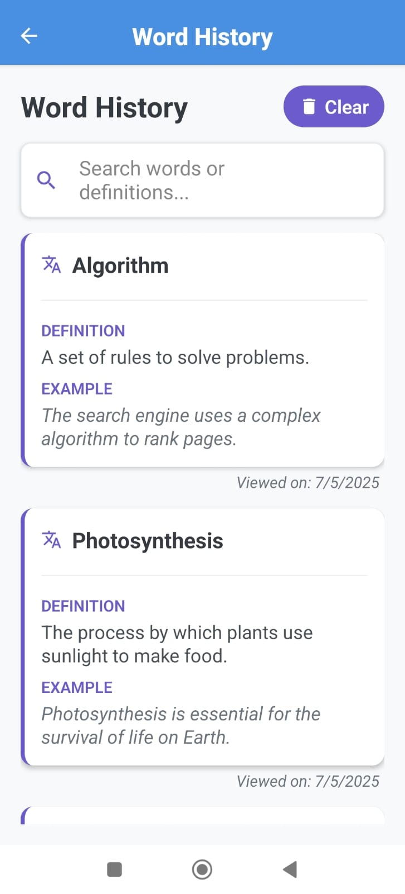
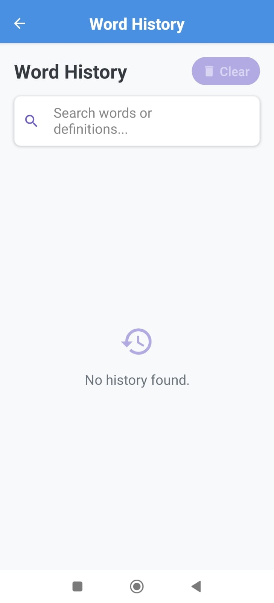
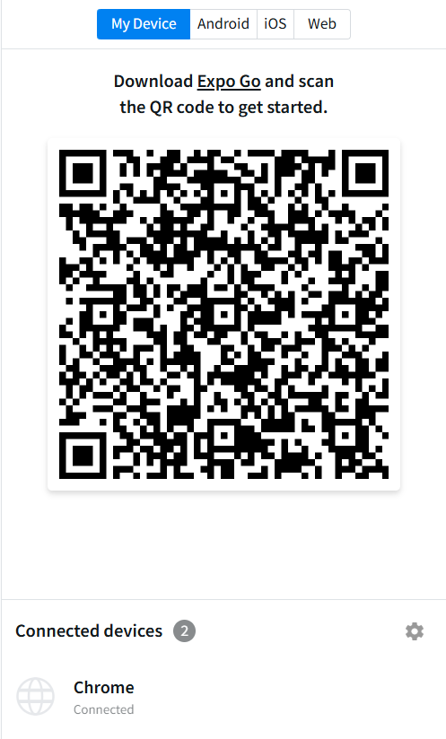

# 📘 Word of the Day App

A lightweight, interactive React Native app built using Expo SDK 52 to display a new English word every day—ranging from tech, science, Gen Z slang, to everyday vocabulary—along with its definition and an example. Includes navigation, search, and persistent history.

## 📸 Screenshots

<p align="center">
  
  
  
</p>

---

## 🚀 Features

- 🏠 **Home Screen**
  - Shows the “Word of the Day” with definition and example.
  - Button to fetch a new word.
  - Swipe right to get the next word.
  - Swipe left to view the previous word.
  - Navigate to history screen.

- 🕓 **History Screen**
  - Displays previously viewed words with definitions and dates.
  - Search bar to filter words.
  - "Clear History" button to remove all past entries.

- 💾 **Persistence**
  - All words are stored using `AsyncStorage` to persist between sessions.

- 🔀 **Navigation**
  - Seamless transition between Home and History screens using `React Navigation`.

---

## 🧪 Testing Instructions

### ✅ Option 1: Use Snack (Recommended)

👉 [Click this link to Open in Snack](https://snack.expo.dev/@ozymozy1010/word-of-the-day)

- You can run it directly in the browser, or switch to **Android**, **iOS**, or **My Device** using the toggle at the top.
- 
- ⚠️ Note: The **"Clear History"** button uses `Alert`, which may not work in the **web preview**. Please switch to **Android**, **iOS**, or **My Device** for full functionality.

If testing on your own device:
- Click on the **My Device** it will show a QR Code
- Download **Expo Go (SDK 52)** from here:  
  👉 [https://expo.dev/go](https://expo.dev/go)
- Scan the Snack QR code to open the app.

---

### 🛠 Option 2: Run Locally via CLI

> Ensure your Expo CLI version supports SDK 52.

```bash
git clone https://github.com/YOUR_USERNAME/word-of-the-day-app.git
cd word-of-the-day-app
npm install
npx expo start

